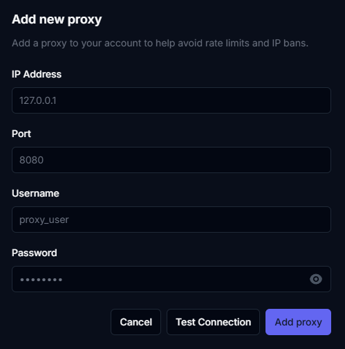

# Proxies


Using free proxies is **not** recommended. See a list below of our recommended providers


### Recommended providers

* IPRoyal: Datacenter plan - 33 Proxies - 30 Days plan minimum - US location

### Setting up your proxies

Once you have some proxies readt, you can start using them in Phoenix.

Head over to your [Proxies settings page](https://dashboard.phoenixtools.app/settings/proxies) to add your proxy.

Adding a proxy is easy, just enter the IP and port, if you need a username and password, you can enter that too.

<figure><figcaption></figcaption></figure>
